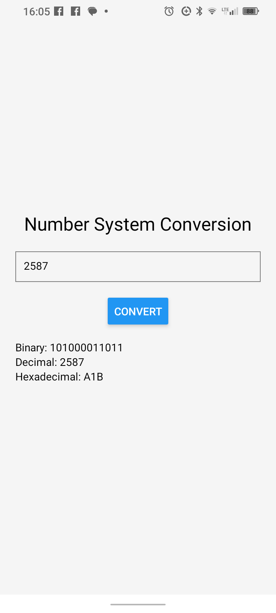

ANDROID NUMBER SYSTEM CONVERSION

1) Features:
   
   Input: decimal format
   
   Output: binary, hexa

3) Tech: React Native, TypeScript, Expo

4) Screenshots

4) Installation

git clone https://github.com/GeoTuxMan/NumberSystemConversion.github

cd NumberSystemConversion

npm install

npm install -g expo-cli

5) Running the App

npx expo start

6) Testing on Physical Decice

Install Expo Go from App Store (iOS) or Google Play (Android)

Start the development server: npx expo start

Scan the QR code with Expo Go app

7) Building the app (.apk)

npm install -g eas-cli

expo install --check

eas build -p android --profile preview

Download apk file from expo.dev
